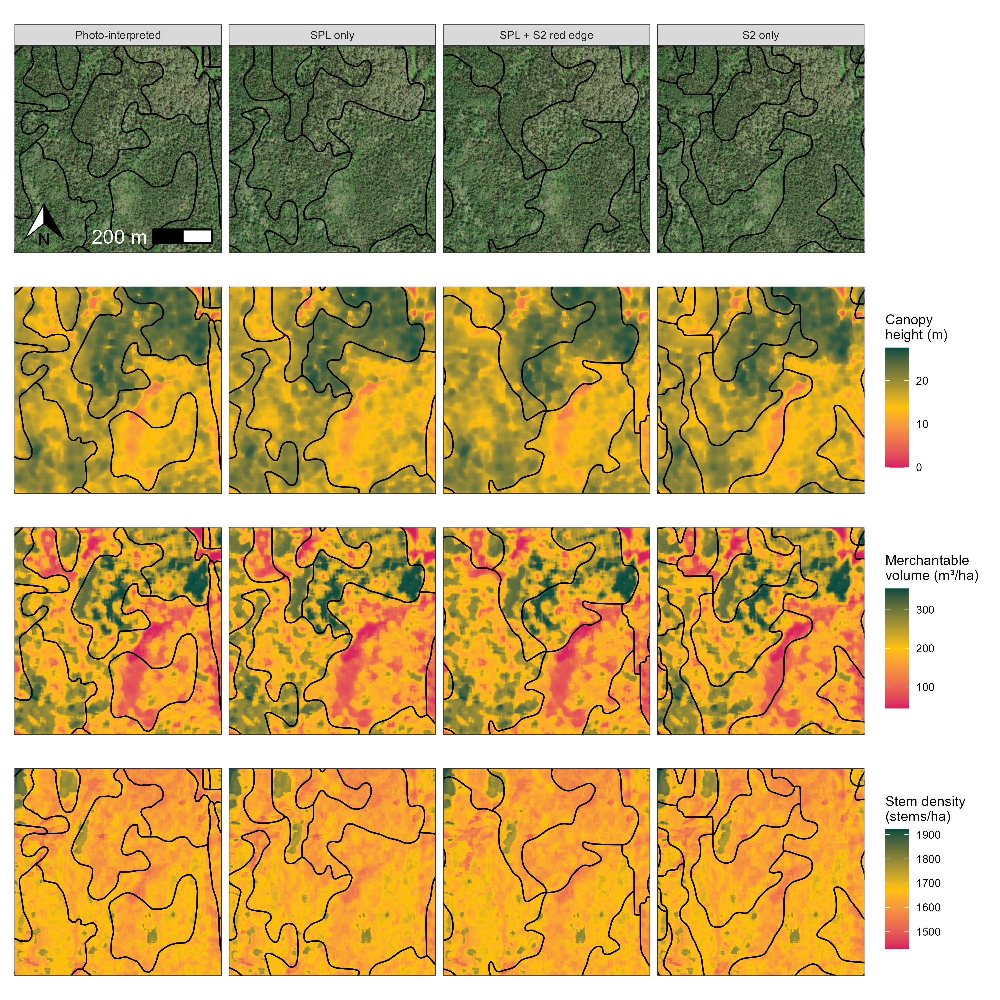
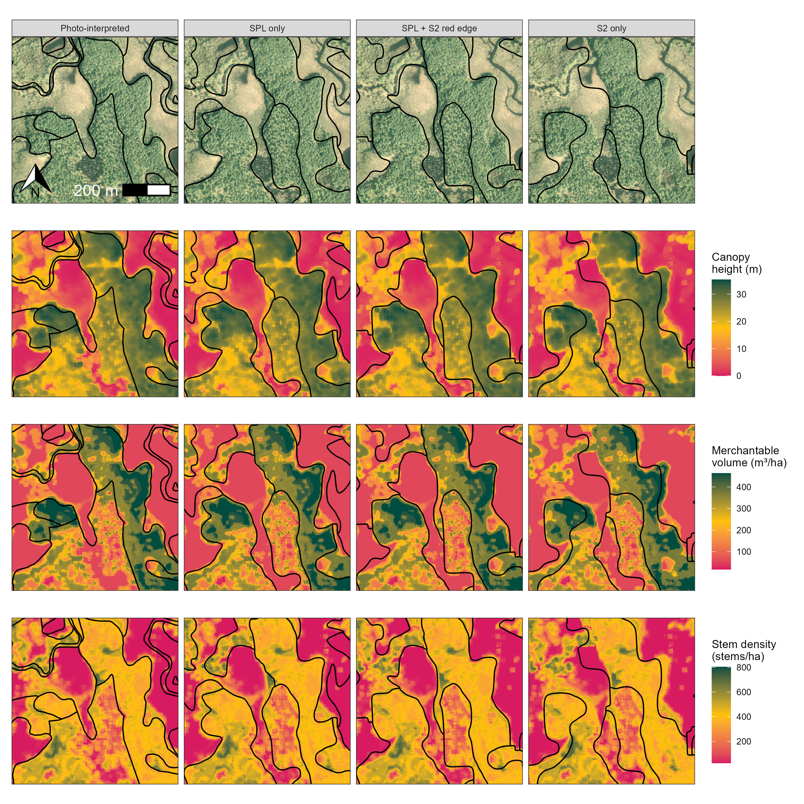
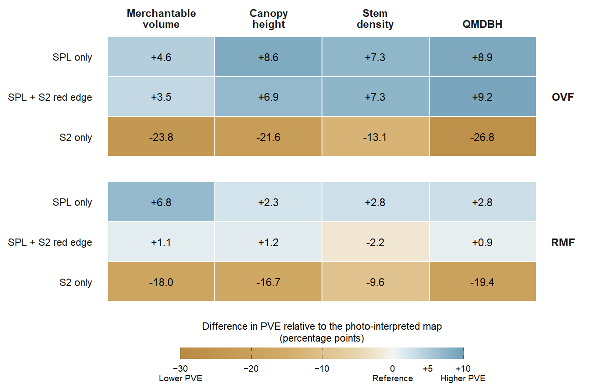
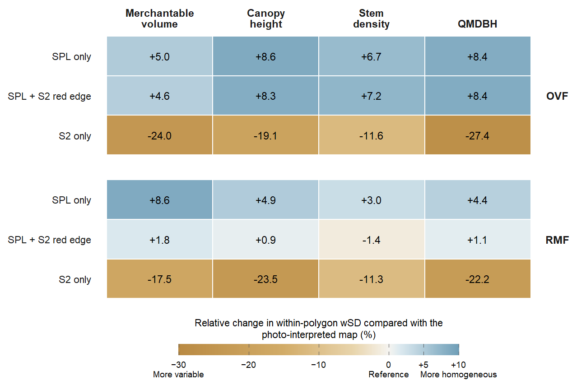
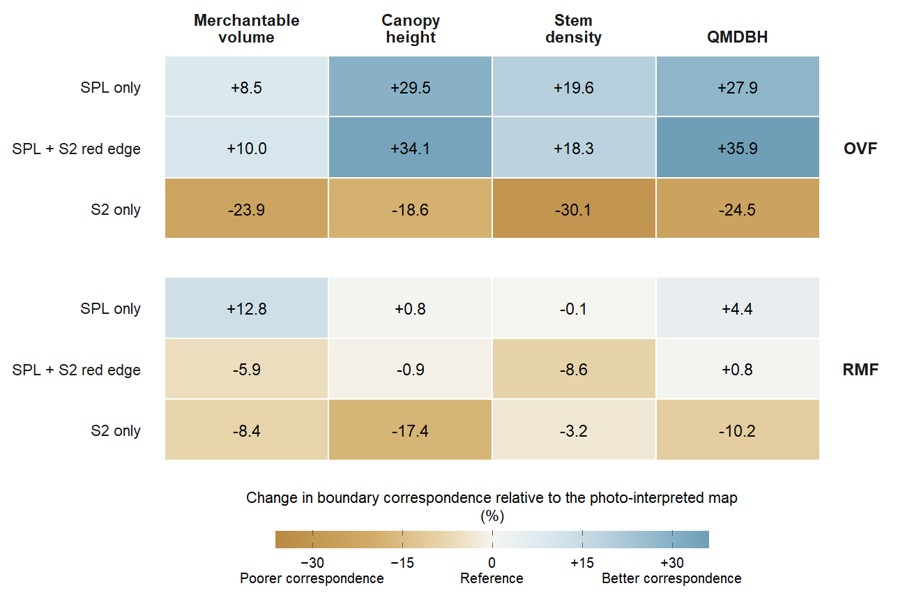

```{r}
#| label: setup
#| include: false

knitr::opts_chunk$set(echo = TRUE)

```

```{r}
#| label: read-library
#| echo: false
#| results: hide
#| message: false
#| warning: false
library(tidyverse)
library(magrittr)
library(terra)
library(tidyterra)
library(sf)
library(knitr)
library(maptiles)
library(patchwork)
```

# **1** Visual comparison of automated stand delineations and photo-interpreted inventory map {-#performance-assessment}

```{r}
#| label: fig-1
#| echo: false
#| message: false
#| warning: false
#| fig-cap: "Example validation area showing the photo-interpreted forest inventory map and retained automated stand delineations overlaid on the reference forest-attribute layers used in the performance assessment."

```

```{r}
#| label: fig-2
#| echo: false
#| message: false
#| warning: false
#| fig-cap: "Example validation area showing the photo-interpreted forest inventory map and retained automated stand delineations overlaid on the reference forest-attribute layers used in the performance assessment."

```

# **2** Partitioning of forest-attribute variability {-#partitioning-forest-attribute-variability}

```{r}
#| label: fig-3
#| echo: false
#| message: false
#| warning: false
#| fig-cap: "Performance of automated stand delineations in partitioning forest-attribute variability relative to the photo-interpreted forest inventory map. Cell values are differences in proportion of variance explained (PVE), expressed in percentage points. Positive values indicate greater PVE than the photo-interpreted inventory map. Canopy height corresponds to the 90th percentile of normalized ULS return heights; QMDBH denotes quadratic mean diameter."

```

# **3** Internal polygon homogeneity {-#internal-polygon-homogeneity}

```{r}
#| label: fig-4
#| echo: false
#| message: false
#| warning: false
#| fig-cap: "Performance of automated stand delineations in improving internal polygon homogeneity relative to the photo-interpreted forest inventory map. Cell values represent the relative change in area-weighted within-polygon standard deviation (wSD), expressed as percentages relative to the photo-interpreted inventory map. Positive values indicate lower within-polygon variability than the photo-interpreted inventory map. Canopy height corresponds to the 90th percentile of normalized ULS return heights; QMDBH denotes quadratic mean diameter."

```

# **4** Correspondence of stand boundaries with structural transitions {-#correspondence-structural-transition}

```{r}
#| label: fig-5
#| echo: false
#| message: false
#| warning: false
#| fig-cap: "Performance of automated stand delineations in improving correspondence of stand boundaries with structural transitions relative to the photo-interpreted forest inventory map. Cell values represent the relative change in correspondence between a stands boundary and a detected structural structure, expressed as percentages relative to the photo-interpreted inventory map. Positive values indicate higher correspondence. Canopy height corresponds to the 90th percentile of normalized ULS return heights; QMDBH denotes quadratic mean diameter."

```
