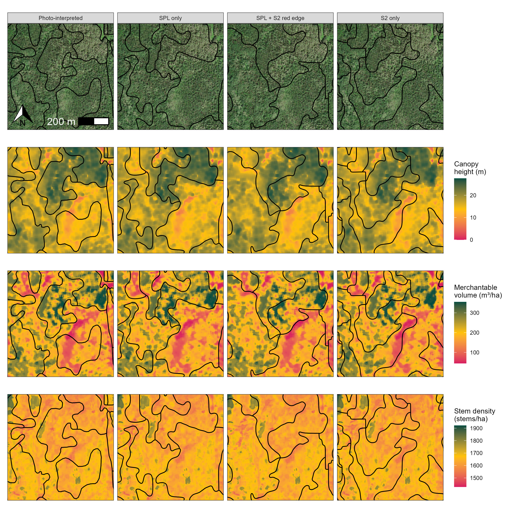
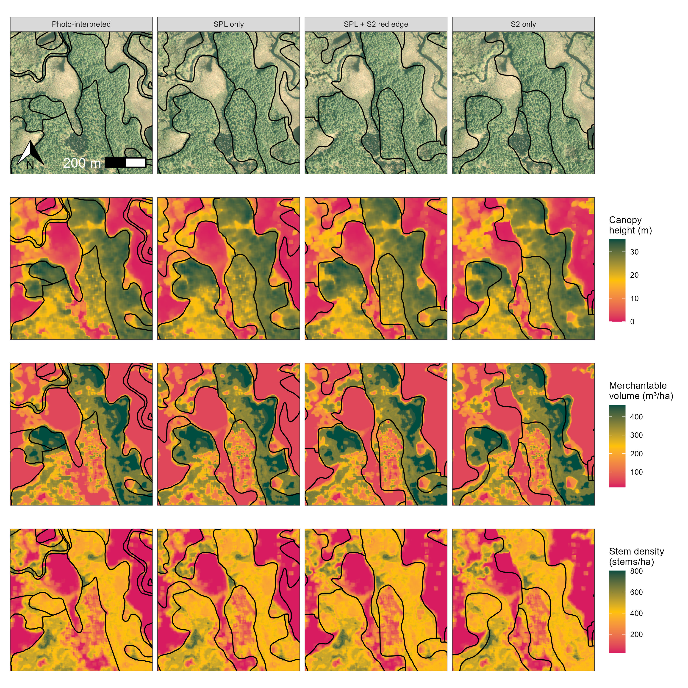
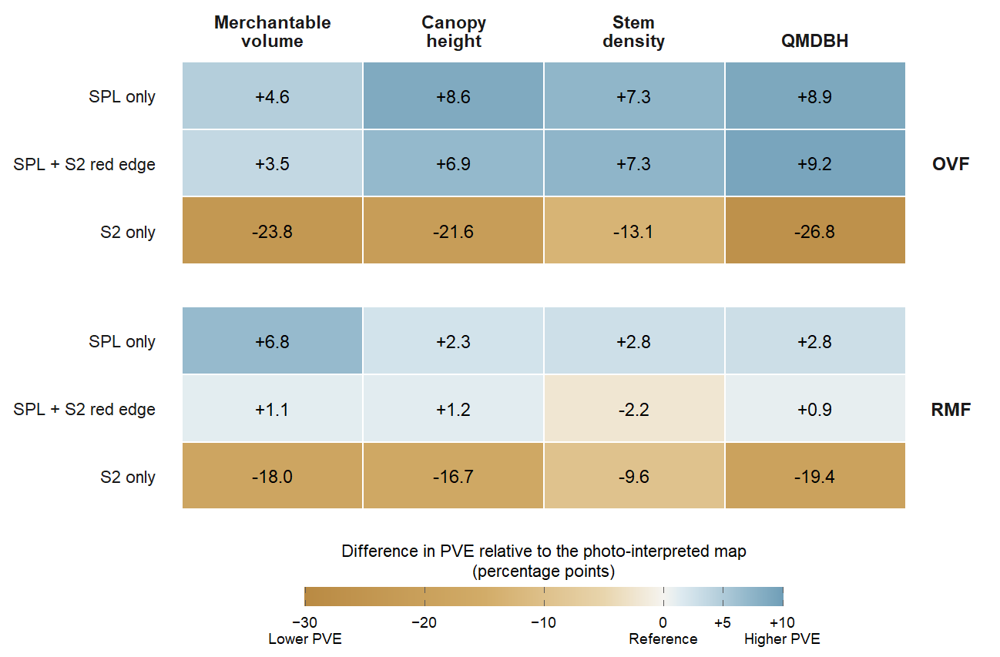
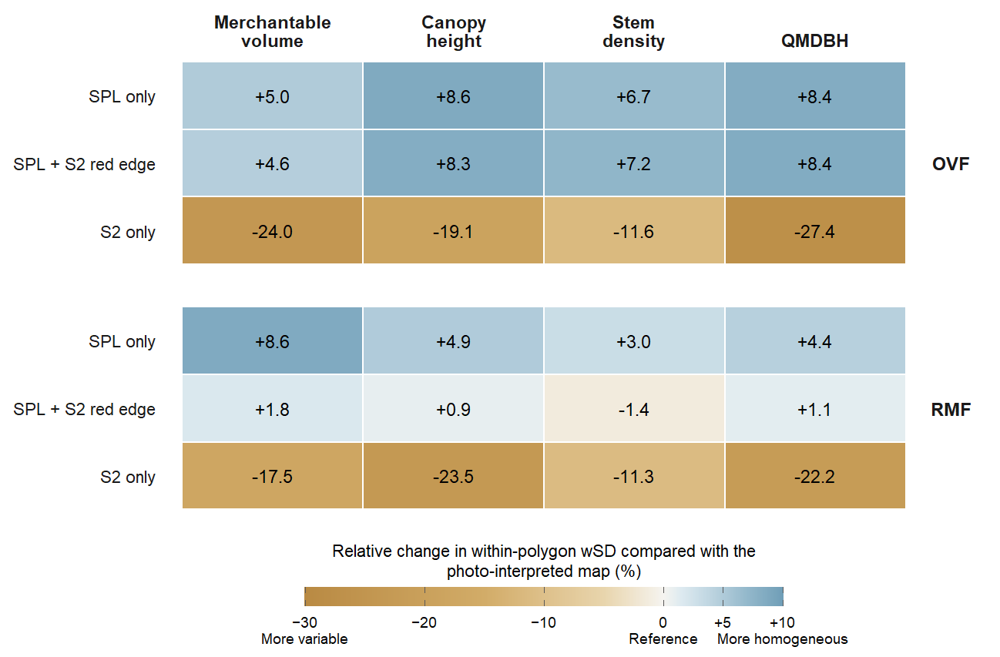
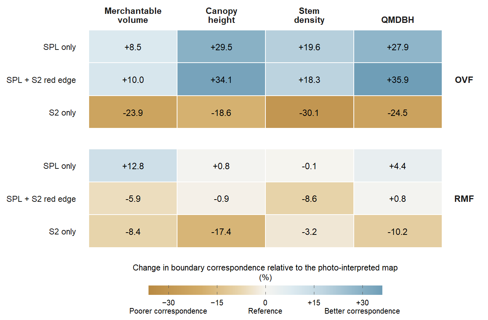

```{r}
#| label: setup
#| include: false

knitr::opts_chunk$set(echo = TRUE)

```

```{r}
#| label: read-library
#| echo: false
#| results: hide
#| message: false
#| warning: false
library(tidyverse)
library(magrittr)
library(terra)
library(tidyterra)
library(sf)
library(smoothr)
library(exactextractr)
library(rmapshaper)
library(nngeo)
library(sf)
library(leaflet)
# pak::pak("metafor-ulaval/eFRItools")
library(eFRItools)
library(knitr)
library(maptiles)
library(patchwork)
library(reticulate)
```

```{r}
#| label: parameters
#| echo: false
#| results: hide
#| message: false
#| warning: false
Sys.setenv(OTB_MAX_RAM_HINT = "65536") # 64 GO
Sys.setenv(OTB_MEMORY_AVAILABLE = "65536") # 64 GO
Sys.setenv(GDAL_CACHEMAX = "65536") # 64 GO
otb_dir <- "D:/00_Ontario_eFRI/10_livrables/softwares/OTB-9.1.0-Win64/bin"

use_python("C:/Program Files/ArcGIS/Pro/bin/Python/envs/arcgispro-py3/python.exe", required = TRUE)
arcpy <- import("arcpy")

wd <- "D:/00_Ontario_eFRI/10_livrables" # wd
summary_metrics <- c("vmerch_ha", "qmdbh", "dens", "ba_ha", "z_p95", "z_above2", "slope", "sagawi")

forests <- c("RMF", "OVF")
models <- list(model_B = c("z_p95", "z_above2", "z_skew"),
               model_F = c("z_p95", "z_above2", "B6"),
               model_G = c("B6", "B8", "B11"))

params <- expand.grid(forests = forests,
                      models = models,
                      stringsAsFactors = FALSE)
```

```{r}
#| label: read-data
#| include: false
#| message: false
#| warning: false
# RMF
# Parameters
param_figures_rmf <- params[3,]
segmentation_metrics <- param_figures_rmf$models[[1]]

segmentation_wd_rmf <- paste0(wd, "/segmentation/", param_figures_rmf$forest, "/", names(param_figures_rmf$models))

list.files(paste0(wd, "/analysis/imputation"), pattern = paste0("results_", param_figures_rmf$forest), full.names = T) %>% 
  map_dfr(function(x){
    read.csv(x) %>%
      arrange(desc(accuracy)) %>%
      slice_max(accuracy, n = 1)
  }) -> imputation_results

# Metrics infos
list.files(paste0(wd, "/metrics/", param_figures_rmf$forest), full.names = TRUE) %>%
  read_metrics() -> metrics_infos_rmf

# EPSG
metrics_infos_rmf %>% 
  filter(name == "dem") %>% 
  pull(path) %>% 
  rast() -> epsg_rast_rmf

epsg_rast_rmf %>% 
  st_crs() -> epsg_rmf

# FMU
st_read(paste0(wd, "/shapefiles/FORMGMT/FOREST_MANAGEMENT_UNIT.shp"), quiet = T) %>% 
  filter(FMU_NAME == "Romeo Malette Forest") %>% 
  st_transform(epsg_rmf) -> rmf

# Areas
rmf %>% 
  st_geometry() %>%
  st_transform(4326) %>% 
  st_as_sf() -> rmf_4326

rmf %>%
  st_bbox() %>%
  st_as_sfc() %>%
  st_centroid() %>%
  st_buffer(2500) %>%
  st_bbox() %>%
  st_as_sfc() %>% 
  st_as_sf() -> subset_area_rmf

subset_area_rmf %>% 
  st_transform(4326) %>% 
  st_as_sf() -> subset_area_rmf_4326

# Imagery
sat_rmf <- get_tiles(x = st_bbox(rmf_4326 %>% st_buffer(5000)),
                     provider = "Esri.WorldImagery",
                     zoom = 11,
                     crop = TRUE)

sat_subset_area_rmf <- get_tiles(x = st_bbox(subset_area_rmf_4326 %>% st_buffer(100)),
                                 provider = "Esri.WorldImagery",
                                 zoom = 15,
                                 crop = TRUE)

# Read metrics
metrics_infos_rmf %>%
  filter(name %in% segmentation_metrics) -> metrics_infos_selected_rmf
  
metrics_infos_selected_rmf %>%
  pull(name) -> metrics_names
  
metrics_infos_selected_rmf %>%
  pull(path) %>%
  map(rast) %>%
  map(project, epsg_rast_rmf, method = "bilinear") %>%
  map(resample, epsg_rast_rmf) %>%
  rast() %>% 
  crop(subset_area_rmf) -> metrics_rmf
  
names(metrics_rmf) <- metrics_names # Assign metrics names

# Masks
list(vect(paste0(wd, "/shapefiles/", param_figures_rmf$forest, "/roads.shp")),
     vect(paste0(wd, "/shapefiles/", param_figures_rmf$forest, "/waterbodies.shp"))) %>%
  map(project, epsg_rast_rmf) %>% 
  map(crop, subset_area_rmf) %>% 
  map(project, subset_area_rmf_4326) -> masks_rmf_4326

# Segmentation
st_read(paste0(segmentation_wd_rmf, "/data.gpkg"), 
         layer = paste0(names(param_figures_rmf$models), "_data_imputation_clipped"), # Clipped on ArcGIS
         quiet = T) %>% 
  st_cast("POLYGON") %>%
  st_transform(epsg_rmf) -> segmentation_rmf

segmentation_rmf %>% 
  st_filter(subset_area_rmf) %>% 
  ms_clip(subset_area_rmf) %>% 
  st_transform(4326) -> segmentation_rmf_clip_4326

# Segmentation smoothed
st_read(paste0(segmentation_wd_rmf, "/data.gpkg"), 
         layer = paste0(names(param_figures_rmf$models), "_data_imputation_smoothed_clipped"), # Clipped on ArcGIS
         quiet = T) %>% 
  st_cast("POLYGON") %>%
  st_transform(epsg_rmf) -> segmentation_smoothed_rmf

segmentation_smoothed_rmf  %>% 
  st_filter(subset_area_rmf) %>% 
  ms_clip(subset_area_rmf) %>% 
  st_transform(4326) -> segmentation_smoothed_rmf_clip_4326

# Segmentation with masks smoothed
st_read(paste0(segmentation_wd_rmf, "/data.gpkg"), 
         layer = paste0(names(param_figures_rmf$models), "_masks_smoothed_clipped"), # Clipped on ArcGIS
         quiet = T) %>% 
  st_cast("POLYGON") %>%
  st_transform(epsg_rmf) -> segmentation_masks_smoothed_rmf

segmentation_masks_smoothed_rmf  %>% 
  st_filter(subset_area_rmf) %>% 
  ms_clip(subset_area_rmf) %>% 
  st_transform(4326) -> segmentation_masks_smoothed_rmf_clip_4326

# Photo-interpreted polygons
st_read(paste0(wd, "/shapefiles/", param_figures_rmf$forest, "/PolygonForest.shp"), 
        quiet = T) %>% 
  st_cast("POLYGON") %>% 
  rowid_to_column("id") %>%
  st_transform(epsg_rmf) -> fri_polygons_rmf

fri_polygons_rmf %>% 
  st_filter(subset_area_rmf) %>% 
  ms_clip(subset_area_rmf) %>% 
  st_transform(4326) -> fri_polygons_rmf_clip_4326


# OVF
# Parameters
param_figures_ovf <- params[4,]
segmentation_metrics <- param_figures_ovf$models[[1]]

segmentation_wd_ovf <- paste0(wd, "/segmentation/", param_figures_ovf$forest, "/", names(param_figures_ovf$models))

# Metrics infos
list.files(paste0(wd, "/metrics/", param_figures_ovf$forest), full.names = TRUE) %>%
  read_metrics() -> metrics_infos_ovf

# EPSG
metrics_infos_ovf %>% 
  filter(name == "dem") %>% 
  pull(path) %>% 
  rast() -> epsg_rast_ovf

epsg_rast_ovf %>% 
  st_crs() -> epsg_ovf

# FMU
st_read(paste0(wd, "/shapefiles/FORMGMT/FOREST_MANAGEMENT_UNIT.shp"), quiet = T) %>% 
  filter(FMU_NAME == "Ottawa Valley Forest") %>% 
  st_transform(epsg_ovf) -> ovf

# Areas
ovf %>% 
  st_geometry() %>%
  st_transform(4326) %>% 
  st_as_sf() -> ovf_4326

ovf %>%
  st_bbox() %>%
  st_as_sfc() %>%
  st_centroid() %>%
  st_buffer(2500) %>%
  st_bbox() %>%
  st_as_sfc() %>% 
  st_as_sf() -> subset_area_ovf

subset_area_ovf %>% 
  st_transform(4326) %>% 
  st_as_sf() -> subset_area_ovf_4326

# Imagery
sat_ovf <- get_tiles(x = st_bbox(ovf_4326 %>% st_buffer(5000)),
                     provider = "Esri.WorldImagery",
                     zoom = 11,
                     crop = TRUE)

sat_subset_area_ovf <- get_tiles(x = st_bbox(subset_area_ovf_4326 %>% st_buffer(100)),
                                 provider = "Esri.WorldImagery",
                                 zoom = 15,
                                 crop = TRUE)

# Segmentation
st_read(paste0(segmentation_wd_ovf, "/data.gpkg"), 
         layer = paste0(names(param_figures_ovf$models), "_data_imputation"), # Clipped on ArcGIS
         quiet = T) %>% 
  st_cast("POLYGON") %>%
  st_transform(epsg_ovf) -> segmentation_ovf

segmentation_ovf %>% 
  st_filter(subset_area_ovf) %>% 
  ms_clip(subset_area_ovf) %>% 
  st_transform(4326) -> segmentation_ovf_clip_4326

# Segmentation smoothed
st_read(paste0(segmentation_wd_ovf, "/data.gpkg"), 
         layer = paste0(names(param_figures_ovf$models), "_data_imputation_smoothed"), # Clipped on ArcGIS
         quiet = T) %>% 
  st_cast("POLYGON") %>%
  st_transform(epsg_ovf) -> segmentation_smoothed_ovf

segmentation_smoothed_ovf  %>% 
  st_filter(subset_area_ovf) %>% 
  ms_clip(subset_area_ovf) %>% 
  st_transform(4326) -> segmentation_smoothed_ovf_clip_4326

# Photo-interpreted polygons
st_read(paste0(wd, "/shapefiles/", param_figures_ovf$forest, "/PolygonForest.shp"), 
        quiet = T) %>% 
  st_cast("POLYGON") %>%
  rowid_to_column("id")  %>% 
  st_transform(epsg_ovf) -> fri_polygons_ovf

fri_polygons_ovf %>% 
  st_filter(subset_area_ovf) %>% 
  ms_clip(subset_area_ovf) %>% 
  st_transform(4326) -> fri_polygons_ovf_clip_4326
```

# **1** Automated stand delineation {-#segmentation-results}
In this section and the [next one](#attribute-table-results), the "SPL + S2 red edge" segmentation model was use. As a reminder, the metrics used for this model are theses one : z_p95 + z_above2 + B6. There is a visual example of the metrics used in the [section 2.4 of Data and Methods](data_and_method.qmd#Segmentation-generation). For both the Romeo Malette Forest (RMF) and Ottawa Valley Forest (OVF), distribution of area and shape index will be showed for the whole Forest Management Unit scale (in yellow in the figure 1 and 2). Furthermore, a visual example of resulting automated stand delineation that was smoothed in ArcGIS will be shown for a closer subset area (in red in the figure 1 and 2). The restricted area of 5x5 km allows for easier visualization.

```{r}
#| label: fig-study-area-subset-rmf
#| echo: false
#| results: hide
#| message: false
#| warning: false
#| fig-cap: "Restricted area of 5x5 km in Romeo Malette Forest."
ggplot() +
  geom_spatraster_rgb(data = sat_rmf*1.5) +
  geom_sf(data = rmf_4326, color = "#FEFE62", fill = NA, lwd = 1) +
  geom_sf(data = subset_area_rmf_4326, color = "red", fill = NA, lwd = 1) +
  scale_x_continuous(expand = c(0, 0)) +
  scale_y_continuous(expand = c(0, 0)) +
  theme_bw()
```

```{r}
#| label: fig-study-area-subset-ovf
#| echo: false
#| results: hide
#| message: false
#| warning: false
#| fig-cap: "Restricted area of 5x5 km in Ottawa Valley Forest."
ggplot() +
  geom_spatraster_rgb(data = sat_ovf*1.5) +
  geom_sf(data = ovf_4326, color = "#FEFE62", fill = NA, lwd = 1) +
  geom_sf(data = subset_area_ovf_4326, color = "red", fill = NA, lwd = 1) +
  scale_x_continuous(expand = c(0, 0)) +
  scale_y_continuous(expand = c(0, 0)) +
  theme_bw()
```

## **1.1**	Delineation products at the Forest Management Unit scale {-#segmentation-results-fmu}

The next figure provide an overview of the resulting smoothed automated stand delineation for RMF in the restricted areas of 5x5 km.
```{r}
#| label: fig-segmentation-exemple-rmf
#| echo: false
#| results: hide
#| message: false
#| warning: false
#| fig-cap: "Smoothed automated stand delineations for the Forest Management Unit of Romeo Malette Forest."
ggplot() +
  geom_spatraster_rgb(data = sat_subset_area_rmf*1.5) +
  geom_sf(data = segmentation_smoothed_rmf_clip_4326, 
          color = "#FFC107", alpha = 0, size = 0.5) +
  geom_sf(data = subset_area_rmf_4326, color = "red", fill = NA, lwd = 1) +
  scale_x_continuous(expand = c(0, 0)) +
  scale_y_continuous(expand = c(0, 0)) +
  theme_bw()
```

As a comparative, the next figure shows the photo-interpreted forest inventory polygons.
```{r}
#| label: fig-fri-exemple-rmf
#| echo: false
#| results: hide
#| message: false
#| warning: false
#| fig-cap: "Photo-interpreted forest inventory polygons for the Forest Management Unit of Romeo Malette Forest."
ggplot() +
  geom_spatraster_rgb(data = sat_subset_area_rmf*1.5) +
  geom_sf(data = fri_polygons_rmf_clip_4326, 
          color = "#1E88E5", alpha = 0, size = 0.5) + 
  geom_sf(data = subset_area_rmf_4326, color = "red", fill = NA, lwd = 1) +
  scale_x_continuous(expand = c(0, 0)) +
  scale_y_continuous(expand = c(0, 0)) +
  theme_bw()
```

And here is the smoothed automated stand delineation and photo-interpreted forest inventory polygons for the Forest Management Unit of Ottawa Valley Forest.

```{r}
#| label: fig-segmentation-exemple-ovf
#| echo: false
#| results: hide
#| message: false
#| warning: false
#| fig-cap: "Smoothed automated stand delineations for the Forest Management Unit of Ottawa Valley Forest."
ggplot() +
  geom_spatraster_rgb(data = sat_subset_area_ovf/1.2) +
  geom_sf(data = segmentation_smoothed_ovf_clip_4326, 
          color = "#FFC107", alpha = 0, size = 0.5) +
  geom_sf(data = subset_area_ovf_4326, color = "red", fill = NA, lwd = 1) +
  scale_x_continuous(expand = c(0, 0)) +
  scale_y_continuous(expand = c(0, 0)) +
  theme_bw()
```

```{r}
#| label: fig-fri-exemple-ovf
#| echo: false
#| results: hide
#| message: false
#| warning: false
#| fig-cap: "Photo-interpreted forest inventory polygons for the Forest Management Unit of Ottawa Valley Forest."
ggplot() +
  geom_spatraster_rgb(data = sat_subset_area_ovf/1.2) +
  geom_sf(data = fri_polygons_ovf_clip_4326, 
          color = "#1E88E5", alpha = 0, size = 0.5) + 
  geom_sf(data = subset_area_ovf_4326, color = "red", fill = NA, lwd = 1) +
  scale_x_continuous(expand = c(0, 0)) +
  scale_y_continuous(expand = c(0, 0)) +
  theme_bw()
```

The resulting polygons can be expected to represent homogeneous forest stands based on choosen metrics. For the whole Romeo Malette Forest, the segmentation produced `r nrow(segmentation_smoothed_rmf)` polygons representing forest stands. Overall, the number of polygon produced is slightly lower as there is `r nrow(fri_polygons_rmf)` photo-interpreted forest inventory polygons. For the Ottawa Valley Forest, a total of `r nrow(segmentation_smoothed_ovf)` polygons was generated by the automated stand delineations which is also lower than than the `r nrow(fri_polygons_ovf)` photo-interpreted forest inventory polygons.

The automated stand delineations can be now compared to photo-interpreted forest inventory polygons for the whole Forest Management Units. Density plots are used to assess whether the distribution of the size and shape are similar. Based on previous parameters obtained by the [segmentation parameters optimisation](https://metafor-ulaval.github.io/Ontario_eFRI/segmentation_parameters_optimisation.html), the difference between distributions are supposed to be minimal and therefore the automated stand delineation should represent operationally plausible forest stand that mimic polygons of the photo-interpreted forest inventory polygons.

Area in hectare is use for size and shape index is use to assess polygon shape. The shape index is determine by this formula :

$$
ShapeIndex = \frac{\text{Perimeter}}{\sqrt{\pi \times \text{Area}}}
$$

The density plot were computed at the pixel level and are therefore area-weighted.

```{r}
#| label: density-rmf
#| echo: false
#| results: hide
#| message: false
#| warning: false
metrics_infos_rmf %>% 
  filter(name == "dem") %>% 
  pull(path) %>% 
  rast() -> metric_ref

# Compute performance metrics
fri_polygons_rmf %>% 
    sf::st_make_valid() %>%
    sf::st_cast("MULTIPOLYGON") %>%
    sf::st_cast("POLYGON") %>%
    mutate(area = as.numeric(sf::st_area(.)),
           perimeter = as.numeric(sf::st_perimeter(.)),
           perimeter_area_ratio = perimeter/area,
           shape_index = perimeter / sqrt(pi * area)) -> polygon_forest_temp

segmentation_rmf %>% 
    sf::st_make_valid() %>%
    sf::st_cast("MULTIPOLYGON") %>%
    sf::st_cast("POLYGON") %>%
    mutate(area = as.numeric(sf::st_area(.)),
           perimeter = as.numeric(sf::st_perimeter(.)),
           perimeter_area_ratio = perimeter/area,
           shape_index = perimeter / sqrt(pi * area)) -> segmentation_temp

segmentation_smoothed_rmf %>% 
    sf::st_make_valid() %>%
    sf::st_cast("MULTIPOLYGON") %>%
    sf::st_cast("POLYGON") %>%
    mutate(area = as.numeric(sf::st_area(.)),
           perimeter = as.numeric(sf::st_perimeter(.)),
           perimeter_area_ratio = perimeter/area,
           shape_index = perimeter / sqrt(pi * area)) -> segmentation_smoothed_temp

# Area in raster
polygon_forest_temp %>%
  dplyr::select(area) %>%
  terra::rasterize(metric_ref, field = "area") %>%
  terra::values(na.rm = TRUE) -> polygon_forest_area_raster

polygon_forest_area_raster[is.finite(polygon_forest_area_raster)] -> polygon_forest_area_raster

segmentation_temp %>%
  dplyr::select(area) %>%
  terra::rasterize(metric_ref, field = "area") %>%
  terra::values(na.rm = TRUE) -> segmentation_area_raster

segmentation_area_raster[is.finite(segmentation_area_raster)] -> segmentation_area_raster

segmentation_smoothed_temp %>%
  dplyr::select(area) %>%
  terra::rasterize(metric_ref, field = "area") %>%
  terra::values(na.rm = TRUE) -> segmentation_smoothed_area_raster

segmentation_smoothed_area_raster[is.finite(segmentation_smoothed_area_raster)] -> segmentation_smoothed_area_raster

# Area in data frame
bind_rows(tibble(value = polygon_forest_area_raster, type = "fri"),
          tibble(value = segmentation_area_raster, type = "grm"),
          tibble(value = segmentation_smoothed_area_raster, type = "grm_smoothed")) -> area_data_frame

# Shape index in raster
polygon_forest_temp %>%
  dplyr::select(shape_index) %>%
  terra::rasterize(metric_ref, field = "shape_index") %>%
  terra::values(na.rm = TRUE) -> polygon_forest_shape_index_raster

polygon_forest_shape_index_raster[is.finite(polygon_forest_shape_index_raster)] -> polygon_forest_shape_index_raster

segmentation_temp %>%
  dplyr::select(shape_index) %>%
  terra::rasterize(metric_ref, field = "shape_index") %>%
  terra::values(na.rm = TRUE) -> segmentation_shape_index_raster

segmentation_shape_index_raster[is.finite(segmentation_shape_index_raster)] -> segmentation_shape_index_raster

segmentation_smoothed_temp %>%
  dplyr::select(shape_index) %>%
  terra::rasterize(metric_ref, field = "shape_index") %>%
  terra::values(na.rm = TRUE) -> segmentation_smoothed_shape_index_raster

segmentation_smoothed_shape_index_raster[is.finite(segmentation_smoothed_shape_index_raster)] -> segmentation_smoothed_shape_index_raster

# Shape index in data frame
bind_rows(tibble(value = polygon_forest_shape_index_raster, type = "fri"),
          tibble(value = segmentation_shape_index_raster, type = "grm"),
          tibble(value = segmentation_smoothed_shape_index_raster, type = "grm_smoothed")) -> shape_index_data_frame
```

```{r}
#| label: fig-density-area-rmf
#| echo: false
#| results: hide
#| message: false
#| warning: false
#| fig-cap: "Polygon area (ha) density of photo-interpreted forest inventory polygon and smoothed automated stand delineations for the Forest Management Unit of Romeo Malette Forest."
area_data_frame %>% 
  ggplot() +
  geom_density(aes(x = value/10000,
                   color = type),
               linewidth = 1) +
  # Area weighted
  geom_vline(aes(xintercept = ave(value/10000, type, FUN = median),
                 color = type),
             linetype = 5) +
  # # Direct polygons
  # geom_vline(xintercept = median(polygon_forest_temp$area)/10000, color = "#1E88E5", linetype = 5) +
  # geom_vline(xintercept = median(segmentation_temp$area)/10000, color = "#D81B60", linetype = 5) +
  # geom_vline(xintercept = median(segmentation_smoothed_temp$area)/10000, color = "#FFC107", linetype = 5) +
  scale_color_manual(values = c("#1E88E5", "#D81B60", "#FFC107"),
                     labels = c("Photo-interpreted forest\ninventory polygons", "Automated stand\ndelineations", "Smoothed automated\nstand delineations")) +
  xlim(c(0, 200)) +
  labs(x = "Polygon area (ha)",
       y = "Density") +
  theme_bw() +
  theme(legend.position = "bottom",
        legend.title = element_blank())
```

```{r}
#| label: fig-density-shape-rmf
#| echo: false
#| results: hide
#| message: false
#| warning: false
#| fig-cap: "Polygon shape index density of photo-interpreted forest inventory polygon and smoothed automated stand delineations for the Forest Management Unit of Romeo Malette Forest."
shape_index_data_frame %>% 
  ggplot() +
  geom_density(aes(x = value,
                   color = type),
               linewidth = 1) +
  # Area weighted
  geom_vline(aes(xintercept = ave(value, type, FUN = median),
                 color = type),
             linetype = 5) +
  # # Direct polygons
  # geom_vline(xintercept = median(polygon_forest_temp$shape_index), color = "#1E88E5", linetype = 5) +
  # geom_vline(xintercept = median(segmentation_temp$shape_index), color = "#D81B60", linetype = 5) +
  # geom_vline(xintercept = median(segmentation_smoothed_temp$shape_index), color = "#FFC107", linetype = 5) +
  scale_color_manual(values = c("#1E88E5", "#D81B60", "#FFC107"),
                     labels = c("Photo-interpreted forest\ninventory polygons", "Automated stand\ndelineations", "Smoothed automated\nstand delineations")) +
  xlim(c(0, 20)) +
  labs(x = "Shape index",
       y = "Density") +
  theme_bw() +
  theme(legend.position = "bottom",
        legend.title = element_blank())
```

```{r}
#| label: density-ovf
#| echo: false
#| results: hide
#| message: false
#| warning: false
metrics_infos_ovf %>% 
  filter(name == "dem") %>% 
  pull(path) %>% 
  rast() -> metric_ref

# Compute performance metrics
fri_polygons_ovf %>% 
    sf::st_make_valid() %>%
    sf::st_cast("MULTIPOLYGON") %>%
    sf::st_cast("POLYGON") %>%
    mutate(area = as.numeric(sf::st_area(.)),
           perimeter = as.numeric(sf::st_perimeter(.)),
           perimeter_area_ratio = perimeter/area,
           shape_index = perimeter / sqrt(pi * area)) -> polygon_forest_temp

segmentation_ovf %>% 
    sf::st_make_valid() %>%
    sf::st_cast("MULTIPOLYGON") %>%
    sf::st_cast("POLYGON") %>%
    mutate(area = as.numeric(sf::st_area(.)),
           perimeter = as.numeric(sf::st_perimeter(.)),
           perimeter_area_ratio = perimeter/area,
           shape_index = perimeter / sqrt(pi * area)) -> segmentation_temp

segmentation_smoothed_ovf %>% 
    sf::st_make_valid() %>%
    sf::st_cast("MULTIPOLYGON") %>%
    sf::st_cast("POLYGON") %>%
    mutate(area = as.numeric(sf::st_area(.)),
           perimeter = as.numeric(sf::st_perimeter(.)),
           perimeter_area_ratio = perimeter/area,
           shape_index = perimeter / sqrt(pi * area)) -> segmentation_smoothed_temp

# Area in raster
polygon_forest_temp %>%
  dplyr::select(area) %>%
  terra::rasterize(metric_ref, field = "area") %>%
  terra::values(na.rm = TRUE) -> polygon_forest_area_raster

polygon_forest_area_raster[is.finite(polygon_forest_area_raster)] -> polygon_forest_area_raster

segmentation_temp %>%
  dplyr::select(area) %>%
  terra::rasterize(metric_ref, field = "area") %>%
  terra::values(na.rm = TRUE) -> segmentation_area_raster

segmentation_area_raster[is.finite(segmentation_area_raster)] -> segmentation_area_raster

segmentation_smoothed_temp %>%
  dplyr::select(area) %>%
  terra::rasterize(metric_ref, field = "area") %>%
  terra::values(na.rm = TRUE) -> segmentation_smoothed_area_raster

segmentation_smoothed_area_raster[is.finite(segmentation_smoothed_area_raster)] -> segmentation_smoothed_area_raster

# Area in data frame
bind_rows(tibble(value = polygon_forest_area_raster, type = "fri"),
          tibble(value = segmentation_area_raster, type = "grm"),
          tibble(value = segmentation_smoothed_area_raster, type = "grm_smoothed")) -> area_data_frame

# Shape index in raster
polygon_forest_temp %>%
  dplyr::select(shape_index) %>%
  terra::rasterize(metric_ref, field = "shape_index") %>%
  terra::values(na.rm = TRUE) -> polygon_forest_shape_index_raster

polygon_forest_shape_index_raster[is.finite(polygon_forest_shape_index_raster)] -> polygon_forest_shape_index_raster

segmentation_temp %>%
  dplyr::select(shape_index) %>%
  terra::rasterize(metric_ref, field = "shape_index") %>%
  terra::values(na.rm = TRUE) -> segmentation_shape_index_raster

segmentation_shape_index_raster[is.finite(segmentation_shape_index_raster)] -> segmentation_shape_index_raster

segmentation_smoothed_temp %>%
  dplyr::select(shape_index) %>%
  terra::rasterize(metric_ref, field = "shape_index") %>%
  terra::values(na.rm = TRUE) -> segmentation_smoothed_shape_index_raster

segmentation_smoothed_shape_index_raster[is.finite(segmentation_smoothed_shape_index_raster)] -> segmentation_smoothed_shape_index_raster

# Shape index in data frame
bind_rows(tibble(value = polygon_forest_shape_index_raster, type = "fri"),
          tibble(value = segmentation_shape_index_raster, type = "grm"),
          tibble(value = segmentation_smoothed_shape_index_raster, type = "grm_smoothed")) -> shape_index_data_frame
```

```{r}
#| label: fig-density-area-ovf
#| echo: false
#| results: hide
#| message: false
#| warning: false
#| fig-cap: "Polygon area (ha) density of photo-interpreted forest inventory polygon and smoothed automated stand delineations for the Forest Management Unit of Ottawa Valley Forest."
area_data_frame %>% 
  ggplot() +
  geom_density(aes(x = value/10000,
                   color = type),
               linewidth = 1) +
  # Area weighted
  geom_vline(aes(xintercept = ave(value/10000, type, FUN = median),
                 color = type),
             linetype = 5) +
  # # Direct polygons
  # geom_vline(xintercept = median(polygon_forest_temp$area)/10000, color = "#1E88E5", linetype = 5) +
  # geom_vline(xintercept = median(segmentation_temp$area)/10000, color = "#D81B60", linetype = 5) +
  # geom_vline(xintercept = median(segmentation_smoothed_temp$area)/10000, color = "#FFC107", linetype = 5) +
  scale_color_manual(values = c("#1E88E5", "#D81B60", "#FFC107"),
                     labels = c("Photo-interpreted forest\ninventory polygons", "Automated stand\ndelineations", "Smoothed automated\nstand delineations")) +
  xlim(c(0, 200)) +
  labs(x = "Polygon area (ha)",
       y = "Density") +
  theme_bw() +
  theme(legend.position = "bottom",
        legend.title = element_blank())
```

```{r}
#| label: fig-density-shape-ovf
#| echo: false
#| results: hide
#| message: false
#| warning: false
#| fig-cap: "Polygon shape index density of photo-interpreted forest inventory polygon and smoothed automated stand delineations for the Forest Management Unit of Ottawa Valley Forest."
shape_index_data_frame %>% 
  ggplot() +
  geom_density(aes(x = value,
                   color = type),
               linewidth = 1) +
  # Area weighted
  geom_vline(aes(xintercept = ave(value, type, FUN = median),
                 color = type),
             linetype = 5) +
  # # Direct polygons
  # geom_vline(xintercept = median(polygon_forest_temp$shape_index), color = "#1E88E5", linetype = 5) +
  # geom_vline(xintercept = median(segmentation_temp$shape_index), color = "#D81B60", linetype = 5) +
  # geom_vline(xintercept = median(segmentation_smoothed_temp$shape_index), color = "#FFC107", linetype = 5) +
  scale_color_manual(values = c("#1E88E5", "#D81B60", "#FFC107"),
                     labels = c("Photo-interpreted forest\ninventory polygons", "Automated stand\ndelineations", "Smoothed automated\nstand delineations")) +
  xlim(c(0, 20)) +
  labs(x = "Shape index",
       y = "Density") +
  theme_bw() +
  theme(legend.position = "bottom",
        legend.title = element_blank())
```

## **1.2** Additionnal parameters {-#segmentation-results-example}
It is recommended to perform a smoothing step that can be made later in ArcGIS Pro or any GIS with a smoothing tool that keep the topology of adjacent polygons. The tool use in this case is "Smooth Polygon" of the toolbox "Cartography". The parameters used are as follow :

 * algorithm = "PAEK"; 
 * tolerance = 100; 
 * endpoint_option = "FIXED_ENDPOINT" 
 * error_option = "RESOLVE_ERRORS".
 
The next figure shows automated stand delineation before smoothing.

```{r}
#| label: fig-segmentation-non-smoothed
#| echo: false
#| results: hide
#| message: false
#| warning: false
#| fig-cap: "Automated stand delineations."
ggplot() +
  geom_spatraster_rgb(data = sat_subset_area_rmf*1.5) +
  geom_sf(data = segmentation_rmf_clip_4326, 
          color = "#D81B60", alpha = 0, size = 0.5) +
  geom_sf(data = subset_area_rmf_4326, color = "red", fill = NA, lwd = 1) +
  scale_x_continuous(expand = c(0, 0)) +
  scale_y_continuous(expand = c(0, 0)) +
  theme_bw()
```

With smoothing, the polygons looks more natural and the border seems to better mimic the edges of actual forest stands.

```{r}
#| label: fig-segmentation-smoothed
#| echo: false
#| results: hide
#| message: false
#| warning: false
#| fig-cap: "Smoothed automated stand delineations."
ggplot() +
  geom_spatraster_rgb(data = sat_subset_area_rmf*1.5) +
  geom_sf(data = segmentation_smoothed_rmf_clip_4326, 
          color = "#FFC107", alpha = 0, size = 0.5) +
  geom_sf(data = subset_area_rmf_4326, color = "red", fill = NA, lwd = 1) +
  scale_x_continuous(expand = c(0, 0)) +
  scale_y_continuous(expand = c(0, 0)) +
  theme_bw()
```

An additional data that can be used in automated stand delineation are masks where there is no forest and therefore the segmentation is not performed. These are typically waterbodies and roads. 

```{r}
#| label: fig-segmentation-masks
#| echo: false
#| results: hide
#| message: false
#| warning: false
#| fig-cap: "Mask used where segmentation is not performed."
ggplot() +
  geom_spatraster_rgb(data = sat_subset_area_rmf*1.5) +
  geom_sf(data = masks_rmf_4326[[1]], 
          color = "grey", size = 1) +
  geom_sf(data = masks_rmf_4326[[2]], 
          color = "#4F81BD", fill = "#A6CDE4", size = 0.5) +
  geom_sf(data = subset_area_rmf_4326, color = "red", fill = NA, lwd = 1) +
  scale_x_continuous(expand = c(0, 0)) +
  scale_y_continuous(expand = c(0, 0)) +
  theme_bw()
```

Here is the resulting automated stand delineation when the masks are considered. It is important to note that the Generic Region Merging algorithm is extremely sensitive to any parameters change. Every slightly input change will drastically change the resulting polygons, even a slightly bigger extent where the algorithm is run. This is the reason why the polygons in the figure x are different from the one at the figure x, even if parameters and metrics as input are the same.

```{r}
#| label: fig-segmentation-masks-applied
#| echo: false
#| results: hide
#| message: false
#| warning: false
#| fig-cap: "Resulting polygon after the masks applications."
ggplot() +
  geom_spatraster_rgb(data = sat_subset_area_rmf*1.5) +
  geom_sf(data = segmentation_masks_smoothed_rmf_clip_4326,
          color = "#FFC107", alpha = 0, size = 0.5) +
  geom_sf(data = subset_area_rmf_4326, color = "red", fill = NA, lwd = 1) +
  scale_x_continuous(expand = c(0, 0)) +
  scale_y_continuous(expand = c(0, 0)) +
  theme_bw()
```

# **2** Example of the final attributed polygon dataset {-#attribute-table-results}
In addition to producing automated stand delineations, the project generated attributed polygon datasets intended to support forest inventory applications. Each polygon is associated with forest attributes obtained directly from available geospatial datasets or estimated using the procedures described in the Data and Methods section.

Figure X illustrates the structure of the final dataset for an example stand.
*Tes exemples de valeurs par polygone avec palette couleur
•	Une capture d'écran ArcGIS/QGIS avec le produit polygonal. 
•	Un polygone sélectionné. 
•	Sa table attributaire visible.

The next figures show what can look like some of theses attributes.

```{r}
#| label: fig-eFRI-attibut-forest-age
#| echo: false
#| results: hide
#| message: false
#| warning: false
#| fig-cap: "Forest age"
ggplot() +
  geom_spatraster_rgb(data = sat_subset_area_rmf*1.5) +
  geom_sf(data = segmentation_smoothed_rmf_clip_4326, aes(fill = AGE)) + 
  geom_sf(data = subset_area_rmf_4326, color = "red", fill = NA, lwd = 1) +
  labs(fill = "Forest age") +
  scale_fill_continuous(palette = c("#D81B60", "#FFC107", "#004D40"),
                        breaks = scales::pretty_breaks(n = 3)) +
  scale_x_continuous(expand = c(0, 0)) +
  scale_y_continuous(expand = c(0, 0)) +
  theme_bw() +
  theme(legend.position = "bottom")
```

```{r}
#| label: fig-eFRI-attibut-last-disturbance
#| echo: false
#| results: hide
#| message: false
#| warning: false
#| fig-cap: "Year of last disturbance"
ggplot() +
  geom_spatraster_rgb(data = sat_subset_area_rmf*1.5) +
  geom_sf(data = segmentation_smoothed_rmf_clip_4326, aes(fill = YRDEP)) + 
  geom_sf(data = subset_area_rmf_4326, color = "red", fill = NA, lwd = 1) +
  labs(fill = "Year of last disturbance") +
  scale_fill_continuous(palette = c("#D81B60", "#FFC107", "#004D40"),
                        breaks = scales::pretty_breaks(n = 3)) +
  scale_x_continuous(expand = c(0, 0)) +
  scale_y_continuous(expand = c(0, 0)) +
  theme_bw() +
  theme(legend.position = "bottom")
```

```{r}
#| label: fig-eFRI-attibut-vmerch
#| echo: false
#| results: hide
#| message: false
#| warning: false
#| fig-cap: "Merchantable volume per hectare"
ggplot() +
  geom_spatraster_rgb(data = sat_subset_area_rmf*1.5) +
  geom_sf(data = segmentation_smoothed_rmf_clip_4326, aes(fill = VMERCH_HA)) + 
  geom_sf(data = subset_area_rmf_4326, color = "red", fill = NA, lwd = 1) +
  labs(fill = "Merchantable volume per hectare") +
  scale_fill_continuous(palette = c("#D81B60", "#FFC107", "#004D40"),
                        breaks = scales::pretty_breaks(n = 3)) +
  scale_x_continuous(expand = c(0, 0)) +
  scale_y_continuous(expand = c(0, 0)) +
  theme_bw() +
  theme(legend.position = "bottom")
```

```{r}
#| label: fig-eFRI-attibut-qmbdh
#| echo: false
#| results: hide
#| message: false
#| warning: false
#| fig-cap: "Quadratic mean diameter at breast height"
ggplot() +
  geom_spatraster_rgb(data = sat_subset_area_rmf*1.5) +
  geom_sf(data = segmentation_smoothed_rmf_clip_4326, aes(fill = QMDBH)) + 
  geom_sf(data = subset_area_rmf_4326, color = "red", fill = NA, lwd = 1) +
  labs(fill = "Quadratic mean diameter at breast height") +
  scale_fill_continuous(palette = c("#D81B60", "#FFC107", "#004D40"),
                        breaks = scales::pretty_breaks(n = 3)) +
  scale_x_continuous(expand = c(0, 0)) +
  scale_y_continuous(expand = c(0, 0)) +
  theme_bw() +
  theme(legend.position = "bottom")
```

```{r}
#| label: fig-eFRI-attibut-height
#| echo: false
#| results: hide
#| message: false
#| warning: false
#| fig-cap: "Height of forest stand based on median z_p95"
ggplot() +
  geom_spatraster_rgb(data = sat_subset_area_rmf*1.5) +
  geom_sf(data = segmentation_smoothed_rmf_clip_4326, aes(fill = HEIGHT)) + 
  geom_sf(data = subset_area_rmf_4326, color = "red", fill = NA, lwd = 1) +
  labs(fill = "Height of forest stand based on median z_p95") +
  scale_fill_continuous(palette = c("#D81B60", "#FFC107", "#004D40"),
                        breaks = scales::pretty_breaks(n = 3)) +
  scale_x_continuous(expand = c(0, 0)) +
  scale_y_continuous(expand = c(0, 0)) +
  theme_bw() +
  theme(legend.position = "bottom")
```

```{r}
#| label: fig-eFRI-attibut-slope
#| echo: false
#| results: hide
#| message: false
#| warning: false
#| fig-cap: "Median slope"
ggplot() +
  geom_spatraster_rgb(data = sat_subset_area_rmf*1.5) +
  geom_sf(data = segmentation_smoothed_rmf_clip_4326, aes(fill = SLOPE)) + 
  geom_sf(data = subset_area_rmf_4326, color = "red", fill = NA, lwd = 1) +
  labs(fill = "Median slope") +
  scale_fill_continuous(palette = c("#D81B60", "#FFC107", "#004D40"),
                        breaks = scales::pretty_breaks(n = 3)) +
  scale_x_continuous(expand = c(0, 0)) +
  scale_y_continuous(expand = c(0, 0)) +
  theme_bw() +
  theme(legend.position = "bottom")
```

```{r}
#| label: fig-eFRI-attibut-moisture
#| echo: false
#| results: hide
#| message: false
#| warning: false
#| fig-cap: "Soil moisture based on SAGA wetness index"
ggplot() +
  geom_spatraster_rgb(data = sat_subset_area_rmf*1.5) +
  geom_sf(data = segmentation_smoothed_rmf_clip_4326, aes(fill = MOISTURE)) + 
  geom_sf(data = subset_area_rmf_4326, color = "red", fill = NA, lwd = 1) +
  labs(fill = "Soil moisture based on SAGA wetness index") +
  scale_fill_continuous(palette = c("#D81B60", "#FFC107", "#004D40"),
                        breaks = scales::pretty_breaks(n = 3)) +
  scale_x_continuous(expand = c(0, 0)) +
  scale_y_continuous(expand = c(0, 0)) +
  theme_bw() +
  theme(legend.position = "bottom")
```

## **2.1** Imputation results {-#attribute-table-results-imputation}
The table below shows the combinations and their accuracy for each imputed variables in Romeo Malette Forest.

```{r}
#| label: tbl-imputation-results
#| echo: false
#| message: false
#| warning: false
#| tbl-cap: "Imputation combinations and their accuracy for the tree imputed variables in Romeo Malette Forest"
imputation_results %>% 
  mutate(accuracy = round(accuracy*100, 2))  %>% 
  mutate(target_var = case_when(target_var == "SP_NO_1" ~ "Leading species",
                                target_var == "SP_NO_2" ~ "Second species",
                                target_var == "FUNCTIONAL_GROUP_3" ~ "Three functional group class")) %>% 
  mutate(target_var = factor(target_var, 
                             levels = c("Leading species",
                                        "Second species",
                                        "Three functional group class"))) %>% 
  arrange(target_var) %>% 
  dplyr::select("Target variable" = "target_var",
                "Used metrics" = "knn_vars",
                "Accuracy (%)" = "accuracy") -> best_models_clean

knitr::kable(best_models_clean)
``` 

The map below shows the imputed three functional group class (softwood, hardwood and mixedwood). The map at the right show the reference layer used to impute this variable. Even if the accuracy of this imputed variable is quite high, at 73.65 %, the map illustrate that there is still some discrepancy between the reference layer and the automated stand delineation. As there is more and more raster layers characterizing tree species with modeling like Random Forest, and at a quite high accuracy, we therefore recommend to directly extract theses attributes where the segmented polygon are. Theses attributes, like tree species, could therefore be used to infer other information like the tree functionial group class shown below.

```{r}
#| label: fig-imputation-fri
#| echo: false
#| results: hide
#| message: false
#| warning: false
#| fig-cap: "Three functional group class of photo-interpreted forest inventory maps"
fri_polygons_rmf_clip_4326 %>% 
  mutate_species_prop(col_name = "SPCOMP") %>% 
  mutate_species_order(col_name = "SPCOMP") %>% 
  mutate_forest_type() %>% 
  mutate_functional_group(functional_group_5 = FALSE) %>%
  dplyr::select(FUNCTIONAL_GROUP_3) -> imputation_data_1

ggplot() +
  geom_spatraster_rgb(data = sat_subset_area_rmf*1.5) +
  geom_sf(data = imputation_data_1, aes(fill = FUNCTIONAL_GROUP_3)) + 
  geom_sf(data = subset_area_rmf_4326, color = "red", fill = NA, lwd = 1) +
  labs(fill = "Three functional group class") +
  scale_x_continuous(expand = c(0, 0)) +
  scale_y_continuous(expand = c(0, 0)) +
  theme_bw() +
  theme(legend.position = "bottom")
``` 

```{r}
#| label: fig-imputation-segmentation
#| echo: false
#| results: hide
#| message: false
#| warning: false
#| fig-cap: "Three functional group class of automated stand delineations"
segmentation_smoothed_rmf_clip_4326 %>% 
  dplyr::select(FUNCTIONAL_GROUP_3) -> imputation_data_2

ggplot() +
  geom_spatraster_rgb(data = sat_subset_area_rmf*1.5) +
  geom_sf(data = imputation_data_2, aes(fill = FUNCTIONAL_GROUP_3)) +
  geom_sf(data = subset_area_rmf_4326, color = "red", fill = NA, lwd = 1) +
  labs(fill = "Three functional group class") +
  scale_x_continuous(expand = c(0, 0)) +
  scale_y_continuous(expand = c(0, 0)) +
  theme_bw() +
  theme(legend.position = "bottom")
``` 

\newpage

# **3** Performance of automated stand delineations {-#performance-assessment}
## **3.1** Visual comparison of automated stand delineations {-#performance-assessment-visual}
Polygon boundaries are overlaid on the high-resolution forest-attribute layers used for performance assessment, allowing visual comparison of how the different delineations partition spatial variation in canopy height, merchantable volume, and stem density.
```{r}
#| label: fig-visualisation-s1
#| echo: false
#| message: false
#| warning: false
#| fig-cap: "Example validation area showing the photo-interpreted forest inventory map and retained automated stand delineations overlaid on the reference forest-attribute layers used in the performance assessment."

```

```{r}
#| label: fig-visualisation-s7
#| echo: false
#| message: false
#| warning: false
#| fig-cap: "Example validation area showing the photo-interpreted forest inventory map and retained automated stand delineations overlaid on the reference forest-attribute layers used in the performance assessment."

```

## **3.2** Partitioning of forest-attribute variability {-#partitioning-forest-attribute-variability}
The proportion of variance explained (PVE) was used to assess how effectively each delineation partitioned spatial variability in the reference forest attributes. Higher PVE indicates that a greater proportion of the landscape-level variability is represented by differences among polygons.

```{r}
#| label: fig-pve
#| echo: false
#| message: false
#| warning: false
#| fig-cap: "Performance of automated stand delineations in partitioning forest-attribute variability relative to the photo-interpreted forest inventory map. Cell values are differences in proportion of variance explained (PVE), expressed in percentage points. Positive values indicate greater PVE than the photo-interpreted inventory map. Canopy height corresponds to the 90th percentile of normalized ULS return heights; QMDBH denotes quadratic mean diameter."

```

## **3.3** Internal polygon homogeneity {-#internal-polygon-homogeneity}
Internal polygon homogeneity was assessed using the area-weighted mean within-polygon standard deviation (wSD) of the reference forest attributes. Lower values indicate greater structural homogeneity within delineated polygons.

```{r}
#| label: fig-ih
#| echo: false
#| message: false
#| warning: false
#| fig-cap: "Performance of automated stand delineations in improving internal polygon homogeneity relative to the photo-interpreted forest inventory map. Cell values represent the relative change in area-weighted within-polygon standard deviation (wSD), expressed as percentages relative to the photo-interpreted inventory map. Positive values indicate lower within-polygon variability than the photo-interpreted inventory map. Canopy height corresponds to the 90th percentile of normalized ULS return heights; QMDBH denotes quadratic mean diameter."

```

## **3.4** Correspondence of stand boundaries with structural transitions {-#correspondence-structural-transition}
The spatial correspondence between mapped stand boundaries and independently detected structural transitions was evaluated using precision, recall, and F1-score. This analysis assesses the extent to which delineated boundaries coincide with changes in forest structure identified directly from the high-resolution reference layers.

```{r}
#| label: fig-smw
#| echo: false
#| message: false
#| warning: false
#| fig-cap: "Performance of automated stand delineations in improving correspondence of stand boundaries with structural transitions relative to the photo-interpreted forest inventory map. Cell values represent the relative change in correspondence between a stands boundary and a detected structural structure, expressed as percentages relative to the photo-interpreted inventory map. Positive values indicate higher correspondence. Canopy height corresponds to the 90th percentile of normalized ULS return heights; QMDBH denotes quadratic mean diameter."

```

# **4** Final polygon-based eFRI products and tools {-#final-polygon}
The final polygon-based eFRI products developed through the project are available below for both Forest Management Units. The datasets include the automated stand delineations and associated polygon-level forest attributes. An interactive application is also provided to facilitate visualization and exploration of the project outputs.
[Romeo Malette Forest](téléchargement du produit final)

 * éventuellement métadonnées / description des champs.

[Ottawa Valley Forest](téléchargement du produit final)

 * métadonnées / description des champs.

# **5** Interactive automated stand delineation tool {-#interactive-tool}
•	lien vers la Shiny app
•	une phrase expliquant ce qu'elle permet de faire. 

# **6** Additionnal data {-#additionnal-data}
-	Lien vers le code ou la documentation technique
